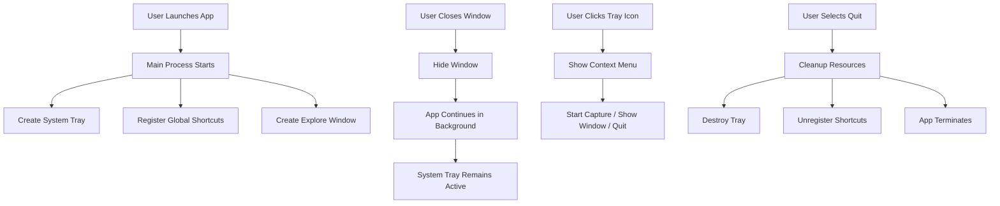

# Design Document: Persistent Color Picker

## Overview

This design enhances the existing Electron color picker application to provide persistent background operation with system tray integration. The application currently supports color capture through global shortcuts and UI buttons but lacks proper lifecycle management for continuous operation. This design introduces system tray functionality, proper window lifecycle management, and ensures the application remains available until explicitly closed by the user.

The core enhancement involves adding a system tray icon with a context menu, modifying the application lifecycle to prevent automatic termination when windows close, and ensuring proper state management between visible and background operation modes.

## Architecture

The application follows Electron's multi-process architecture:

- **Main Process** (`electron/main.ts`): Manages application lifecycle, window creation, system tray, and IPC communication
- **Renderer Processes**: React-based UI for Explore window and Capture overlay
- **Preload Scripts**: Secure bridge between main and renderer processes

### New Components

1. **System Tray Manager** (`electron/tray.ts`): Manages system tray icon and context menu
2. **Enhanced Lifecycle Manager**: Modified `main.ts` to handle background operation
3. **Window State Manager**: Enhanced `windows.ts` to track window visibility states

### Component Interaction Flow



## Components and Interfaces

### System Tray Manager

**File**: `electron/tray.ts`

**Purpose**: Manages the system tray icon and its context menu, providing user access to application functions when no windows are visible.

**Interface**:

```typescript
interface TrayManager {
  createTray(): Tray;
  destroyTray(): void;
  updateTrayMenu(): void;
}

function createTray(): Tray
function destroyTray(): void
function getTray(): Tray | null
```

**Responsibilities**:
- Create system tray icon with appropriate image
- Build and maintain context menu with actions
- Handle menu item clicks and dispatch to appropriate handlers
- Provide platform-specific icon paths (Windows .ico, macOS .png, Linux .png)

**Context Menu Structure**:
```typescript
[
  { label: 'Start Capture', click: () => startCaptureMode() },
  { label: 'Show Window', click: () => showExploreWindow() },
  { type: 'separator' },
  { label: 'Quit', click: () => quitApplication() }
]
```

### Enhanced Main Process

**File**: `electron/main.ts`

**Modifications**:

1. **Initialization**:
```typescript
app.whenReady().then(() => {
  createTray();
  registerGlobalShortcuts();
  createExploreWindow();
});
```

2. **Window Close Behavior**:
```typescript
app.on('window-all-closed', () => {
  // Prevent automatic quit on all platforms
  // App continues running with system tray
});
```

3. **Quit Handler**:
```typescript
app.on('before-quit', () => {
  destroyTray();
  unregisterGlobalShortcuts();
});
```

4. **Explicit Quit Function**:
```typescript
function quitApplication(): void {
  app.quit();
}
```

### Window State Manager

**File**: `electron/windows.ts`

**Enhancements**:

Add state tracking for window visibility:

```typescript
interface WindowState {
  exploreVisible: boolean;
  captureActive: boolean;
  previousExploreState: boolean;
}

let windowState: WindowState = {
  exploreVisible: false,
  captureActive: false,
  previousExploreState: false
};
```

**Modified Functions**:

```typescript
function hideExploreWindow(): void {
  if (exploreWindow && !exploreWindow.isDestroyed()) {
    windowState.previousExploreState = exploreWindow.isVisible();
    exploreWindow.hide();
    windowState.exploreVisible = false;
  }
}

function showExploreWindow(): void {
  if (exploreWindow && !exploreWindow.isDestroyed()) {
    exploreWindow.show();
    windowState.exploreVisible = true;
  } else {
    createExploreWindow();
  }
}

function restoreExploreWindowState(): void {
  if (windowState.previousExploreState) {
    showExploreWindow();
  }
}
```

### IPC Communication

**New IPC Handlers**:

```typescript
// In main.ts
ipcMain.on('quit-app', () => {
  quitApplication();
});

ipcMain.on('show-from-tray', () => {
  showExploreWindow();
});
```

**Existing Handlers** (no changes needed):
- `capture-screen`: Captures screen content
- `copy-to-clipboard`: Copies color to clipboard
- `close-capture`: Closes capture window
- `start-capture`: Initiates capture mode
- `close-explore`: Hides explore window
- `cancel-capture`: Cancels capture and restores state

## Data Models

### Window State

```typescript
interface WindowState {
  exploreVisible: boolean;      // Is explore window currently visible
  captureActive: boolean;        // Is capture mode currently active
  previousExploreState: boolean; // Was explore visible before capture
}
```

### Tray Menu Item

```typescript
interface TrayMenuItem {
  label: string;
  click?: () => void;
  type?: 'normal' | 'separator' | 'submenu' | 'checkbox' | 'radio';
  enabled?: boolean;
  visible?: boolean;
}
```

### Application State

```typescript
interface ApplicationState {
  trayCreated: boolean;
  shortcutsRegistered: boolean;
  windowState: WindowState;
}
```

## Correctness Properties


*A property is a characteristic or behavior that should hold true across all valid executions of a system—essentially, a formal statement about what the system should do. Properties serve as the bridge between human-readable specifications and machine-verifiable correctness guarantees.*

### Background Operation Properties

Property 1: Window closure preserves application lifecycle
*For any* application state with visible windows, closing all windows should result in the application process continuing to run in the background.
**Validates: Requirements 2.1**

Property 2: Background state maintains tray icon
*For any* application state where no windows are visible, the system tray icon should remain present and accessible.
**Validates: Requirements 2.2**

Property 3: Background state preserves shortcut functionality
*For any* application state running in the background, triggering the global shortcut should successfully enter Capture_Mode.
**Validates: Requirements 2.3, 2.4**

Property 4: Explicit quit requirement
*For any* sequence of user actions that does not include selecting "Quit" from the system tray menu, the application process should continue running.
**Validates: Requirements 2.5**

### Launch and Activation Properties

Property 5: Duplicate launch shows window
*For any* application state where the app is already running, launching the application again should make the Explore_Window visible if it was hidden.
**Validates: Requirements 3.2**

### Capture Workflow Properties

Property 6: Capture mode displays overlay
*For any* application state, entering Capture_Mode should result in a fullscreen overlay with magnifier being displayed.
**Validates: Requirements 4.1**

Property 7: Color capture and clipboard
*For any* pixel location clicked during Capture_Mode, the color at that location should be captured and copied to the system clipboard.
**Validates: Requirements 4.2, 4.3**

Property 8: Capture completion restores state
*For any* application state before entering Capture_Mode, successfully capturing a color should exit Capture_Mode and restore the previous state.
**Validates: Requirements 4.4**

Property 9: Capture cancellation restores state
*For any* application state before entering Capture_Mode, pressing Escape during capture should cancel the operation and restore the previous state.
**Validates: Requirements 4.5**

### Window Management Properties

Property 10: Explore window close behavior
*For any* application state with the Explore_Window visible, closing the window should hide it while keeping the application running in the background.
**Validates: Requirements 5.1**

Property 11: Tray show window action
*For any* application state, selecting "Show Window" from the system tray should make the Explore_Window visible.
**Validates: Requirements 5.2**

Property 12: Capture mode hides explore window
*For any* application state where Capture_Mode is active, the Explore_Window should be hidden.
**Validates: Requirements 5.3**

Property 13: Window visibility round-trip
*For any* initial Explore_Window visibility state, entering Capture_Mode and then exiting it should restore the window to its original visibility state.
**Validates: Requirements 5.4**

Property 14: Explore window always on top
*For any* application state where the Explore_Window is visible, it should remain on top of other application windows.
**Validates: Requirements 5.5**

### Platform Compatibility Properties

Property 15: Platform-appropriate keyboard shortcuts
*For any* platform (macOS, Windows, Linux), the global shortcut should use the platform-appropriate modifier key (Cmd on macOS, Ctrl on Windows/Linux).
**Validates: Requirements 6.5**

## Error Handling

### System Tray Creation Failure

**Scenario**: System tray icon creation fails (e.g., platform doesn't support tray icons)

**Handling**:
- Log error with details
- Continue application startup
- Show Explore_Window as fallback
- Display warning notification to user about limited functionality

**Implementation**:
```typescript
try {
  createTray();
} catch (error) {
  console.error('Failed to create system tray:', error);
  showExploreWindow();
  // Show notification about tray unavailability
}
```

### Global Shortcut Registration Failure

**Scenario**: Global shortcut registration fails (e.g., shortcut already in use)

**Handling**:
- Log warning with details
- Continue application startup
- Application remains functional via UI and tray menu
- Optionally notify user that shortcut is unavailable

**Implementation**:
```typescript
const registered = globalShortcut.register('CommandOrControl+Shift+C', handler);
if (!registered) {
  console.warn('Global shortcut registration failed - may be in use');
  // Continue without shortcut
}
```

### Screen Capture Failure

**Scenario**: Screen capture fails (e.g., permission denied, no display sources)

**Handling**:
- Catch error in capture handler
- Close capture window
- Show error notification to user
- Restore previous window state
- Log error details for debugging

**Implementation**:
```typescript
try {
  const result = await captureScreen();
  return result;
} catch (error) {
  console.error('Screen capture failed:', error);
  closeCaptureWindow();
  showExploreWindow();
  // Show error notification
  throw error;
}
```

### Window Creation Failure

**Scenario**: Window creation fails (e.g., insufficient resources)

**Handling**:
- Log error with details
- Attempt to reuse existing window if available
- If critical (Explore window), show error dialog and exit gracefully
- If non-critical (Capture window), show notification and continue

### Clipboard Access Failure

**Scenario**: Clipboard write operation fails

**Handling**:
- Log error with details
- Show error notification to user
- Continue application operation
- Still exit capture mode normally

**Implementation**:
```typescript
try {
  clipboard.writeText(color);
} catch (error) {
  console.error('Failed to write to clipboard:', error);
  // Show error notification but continue
}
```

## Testing Strategy

### Dual Testing Approach

This feature requires both unit tests and property-based tests to ensure comprehensive coverage:

- **Unit tests**: Verify specific examples, edge cases, and error conditions
- **Property tests**: Verify universal properties across all inputs

Both testing approaches are complementary and necessary. Unit tests catch concrete bugs in specific scenarios, while property tests verify general correctness across a wide range of inputs.

### Unit Testing

Unit tests should focus on:

1. **Specific Examples**:
   - Application startup creates tray icon
   - Tray menu contains expected items
   - Quit menu item terminates application
   - Platform-specific icon paths are correct

2. **Edge Cases**:
   - Tray creation when system doesn't support tray icons
   - Shortcut registration when shortcut is already in use
   - Window operations when window is already destroyed
   - Multiple rapid launch attempts

3. **Error Conditions**:
   - Screen capture permission denied
   - Clipboard access denied
   - Window creation failures
   - Invalid window states

4. **Integration Points**:
   - IPC communication between main and renderer
   - Window state transitions
   - Tray menu actions trigger correct handlers

### Property-Based Testing

Property-based tests should verify the universal properties defined in the Correctness Properties section. Each property test should:

- Run a minimum of 100 iterations (due to randomization)
- Reference its corresponding design document property
- Use the tag format: **Feature: persistent-color-picker, Property {number}: {property_text}**

**Property Test Configuration**:

We will use the appropriate property-based testing library for TypeScript/JavaScript:
- **fast-check** for property-based testing in TypeScript

**Property Test Examples**:

1. **Property 1: Window closure preserves application lifecycle**
   - Generate random window configurations
   - Close all windows
   - Verify process continues running
   - Tag: **Feature: persistent-color-picker, Property 1: Window closure preserves application lifecycle**

2. **Property 7: Color capture and clipboard**
   - Generate random pixel coordinates
   - Simulate capture at those coordinates
   - Verify captured color matches pixel color
   - Verify clipboard contains the color value
   - Tag: **Feature: persistent-color-picker, Property 7: Color capture and clipboard**

3. **Property 13: Window visibility round-trip**
   - Generate random initial window visibility states
   - Enter capture mode
   - Exit capture mode
   - Verify window visibility matches initial state
   - Tag: **Feature: persistent-color-picker, Property 13: Window visibility round-trip**

### Test Organization

```
tests/
├── unit/
│   ├── tray.test.ts
│   ├── windows.test.ts
│   ├── lifecycle.test.ts
│   └── shortcuts.test.ts
├── property/
│   ├── background-operation.test.ts
│   ├── capture-workflow.test.ts
│   ├── window-management.test.ts
│   └── platform-compatibility.test.ts
└── integration/
    ├── end-to-end.test.ts
    └── ipc-communication.test.ts
```

### Testing Tools

- **Unit Testing**: Jest or Vitest
- **Property-Based Testing**: fast-check
- **E2E Testing**: Spectron or Playwright for Electron
- **Mocking**: electron-mock-ipc for IPC testing

### Coverage Goals

- Unit test coverage: >80% for new code
- Property tests: All 15 properties implemented
- Integration tests: All user workflows covered
- Manual testing: Cross-platform verification on Windows, macOS, and Linux
